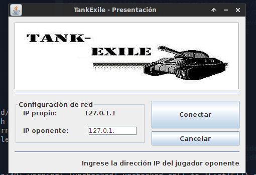
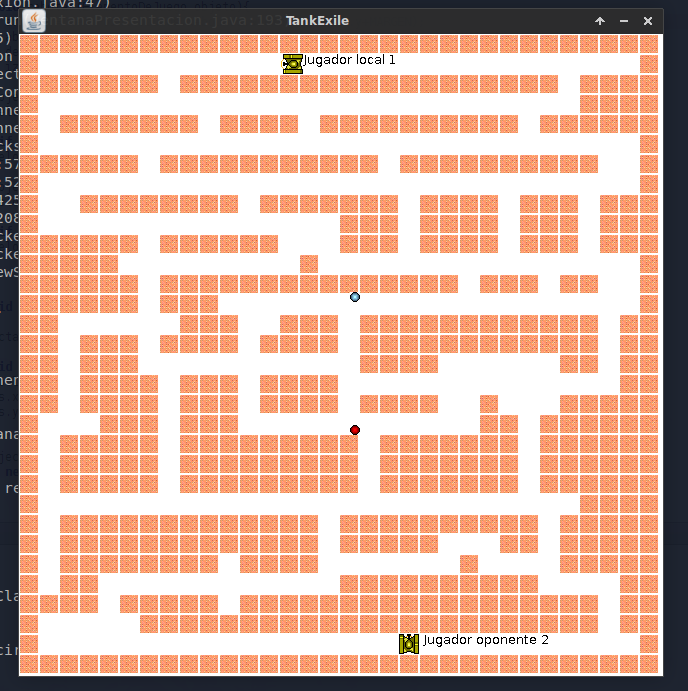

# README

This is a university project. 
Simple game of tanks making full use of polymorphism. 






## Disclaimer

Want to dig into java-begginer bugs? Launch it then :)

## Build

To generate a distributable `jar` do as follows: 

```
ant compile
ant jar
```

## Run

To run the game you will need two different hosts. Copy the `jar` file and 
execute on each the following:

```
java -Djava.rmi.server.hostname=<local-public-ip> -jar dist/TankExile.jar
```
